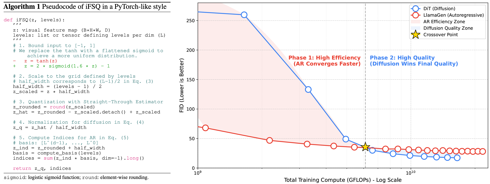

## iFSQ: Improving FSQ for Image Generation with 1 Line of Code<br><sub>Official PyTorch Implementation</sub>

<div align="center">

[](https://arxiv.org/abs/2601.17124)
[](https://huggingface.co/papers/2601.17124)
[](LICENSE.txt)
</div>

This repository contains the official implementation of **iFSQ** and **LlamaGen-REPA**.




## 🚀 Method: The "1 Line of Code"

The key insight is replacing the $$y = \tanh(x)$$ function in the original FSQ with a distribution-matching activation $$y = 2.0 \cdot \sigma(1.6x) - 1$$ that maps unbounded Gaussian latents to a bounded uniform distribution.

## 🌟 Key Contributions

*   🪐 **Methodology:** We propose **iFSQ**, a distribution-aware improvement to FSQ. We resolve the conflict between information efficiency and reconstruction fidelity.
*   ⚡️ **Benchmarking:** We use iFSQ as a unified tokenizer to benchmark AR against diffusion models.
*   💥 **Insights:**
    *   The optimal equilibrium between discrete and continuous representations lies at approximately 4 bits per dimension.
    *   AR models exhibit rapid initial convergence, whereas Diffusion models achieve a superior performance ceiling.
*   🛸 **Extension:** We introduce **LlamaGen-REPA**, adapting Representation Alignment to AR models to enhance semantic alignment.


## 🛠️ Setup

First, download and set up the repo:

```bash
git clone https://github.com/Tencent-Hunyuan/iFSQ.git
cd iFSQ
```

We provide an [`requirements.txt`](requirements.txt) file that can be used to create the environment.

```bash
conda create -n ifsq python=3.10 -y
conda activate ifsq
pip install torch==2.6.0 torchvision==0.21.0 torchaudio==2.6.0 --index-url https://download.pytorch.org/whl/cu124
pip install -r requirements.txt
```

## 🛠️ Usage

### 1. iFSQ

#### Train

```bash
cd ifsq
bash configs/ifsq_f16_d4_4bit/run.sh
```

#### Eval
We record validation metrics during training. We also provide scripts for standalone validation.

```bash
cd ifsq
torchrun --nproc_per_node=8 \
    eval_ddp.py \
    --imgnet_eval_path ${IMAGENETT_VAL} \
    --coco_eval_path ${COCO2017_VAL} \
    --model_name ImageFSQVAE \
    --ckpt_path results/ifsq_f16_d4_4bit/checkpoint-10000.ckpt \
    --model_config configs/ifsq_f16_d4_4bit/run.json \
    --resolution 256 \
    --dataset_num_worker 8 \
    --eval_batch_size 64 \
    --eval_lpips \
    --eval_psnr \
    --eval_ssim \
    --eval_fid \
    --ema
```

### 2. LlamaGen-REPA

#### Train

Using the iFSQ trained in the previous stage.

```bash
cd llamagen
torchrun --nproc_per_node=8 \
    train.py --config configs/fsq17x4_large_repa8_0p5/config.yaml
```

iFSQ can also use multi-codebook, where each token is represented by multiple indices. For example, each token uses 2 indices.

```bash
cd llamagen
torchrun --nproc_per_node=8 \
    train.py --config configs/fsq17x4_ds16_large_repa_d8_2p0_f2x2/config.yaml
```

If you want to use [VQ-VAE](https://github.com/FoundationVision/LlamaGen/tree/main?tab=readme-ov-file#vq-vae-models) in the original [LlamaGen](https://github.com/FoundationVision/LlamaGen).

```bash
cd llamagen
torchrun --nproc_per_node=8 \
    train.py --config configs/large_repa_d8_2p0/config.yaml
```

#### Eval

Generate 50k images and validate using torch_fid, while producing .npz files.

```bash
cd llamagen
torchrun --nproc_per_node=8 \
    inference.py --config configs/large_repa_d8_2p0/config.yaml
```

Alternatively, we also provide tools for validation following [ADM](https://github.com/openai/guided-diffusion/tree/main/evaluations).

```bash
# we recommend cuda12.2
conda create -n adm_eval python=3.10 -y
conda activate adm_eval
pip install tensorflow==2.15.0 scipy requests tqdm numpy==1.23.5
pip install nvidia-pyindex
pip install nvidia-cublas-cu12 nvidia-cuda-cupti-cu12 nvidia-cuda-runtime-cu12 nvidia-cudnn-cu12
wget https://openaipublic.blob.core.windows.net/diffusion/jul-2021/ref_batches/imagenet/256/VIRTUAL_imagenet256_labeled.npz
python tools/evaluator.py \
    VIRTUAL_imagenet256_labeled.npz \
    /path/to/.npz
```

### 3. DiT-REPA

#### Train

```bash
cd dit
accelerate launch --num_processes 8 \
    train.py --config configs/fsq17x4_large_repa8_0p5/run.yaml
```

#### Eval

Generate 50k images and validate using torch_fid, while producing .npz files.

```bash
cd dit
accelerate launch --num_processes 8 \
    inference.py --config configs/fsq17x4_large_repa8_0p5/run.yaml
```

Alternatively, we also provide tools for validation following [ADM](https://github.com/openai/guided-diffusion/tree/main/evaluations).

```bash
conda create -n adm_eval python=3.10 -y
conda activate adm_eval
# cuda12.2
pip install tensorflow==2.15.0 scipy requests tqdm numpy==1.23.5
pip install nvidia-pyindex
pip install nvidia-cublas-cu12 nvidia-cuda-cupti-cu12 nvidia-cuda-runtime-cu12 nvidia-cudnn-cu12
wget https://openaipublic.blob.core.windows.net/diffusion/jul-2021/ref_batches/imagenet/256/VIRTUAL_imagenet256_labeled.npz
python tools/evaluator.py \
    VIRTUAL_imagenet256_labeled.npz \
    /path/to/.npz
```

## 👍 Acknowledgement

This project builds upon the excellent work of the following repositories:

- [WF-VAE](https://github.com/PKU-YuanGroup/WF-VAE): used as the main template for building our training codebase.
- [LightningDiT](https://github.com/hustvl/LightningDiT): referenced for its well-organized configuration file structure.
- [LlamaGen](https://github.com/FoundationVision/LlamaGen): referenced for the original model design and evaluation pipeline.
- [DiT](https://github.com/facebookresearch/DiT): referenced for the original model implementation and evaluation setup.

## 📝 Citation

If you find this work useful for your research, please consider citing our paper:

```bibtex
@misc{lin2026ifsqimprovingfsqimage,
      title={iFSQ: Improving FSQ for Image Generation with 1 Line of Code}, 
      author={Bin Lin and Zongjian Li and Yuwei Niu and Kaixiong Gong and Yunyang Ge and Yunlong Lin and Mingzhe Zheng and JianWei Zhang and Miles Yang and Zhao Zhong and Liefeng Bo and Li Yuan},
      year={2026},
      eprint={2601.17124},
      archivePrefix={arXiv},
      primaryClass={cs.CV},
      url={https://arxiv.org/abs/2601.17124}, 
}
```

## 🔒 License
The majority of this project is licensed under Apache 2.0 License, detailed in [LICENSE.txt](LICENSE.txt).
